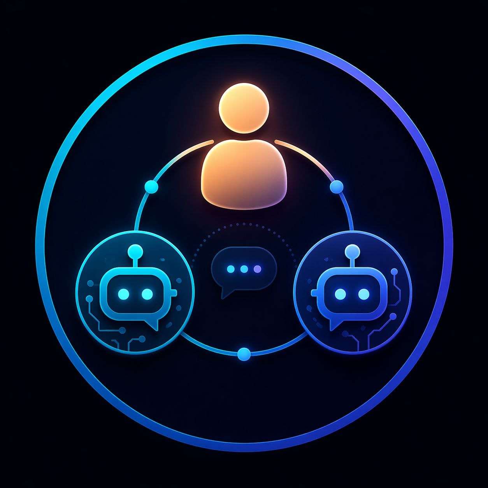
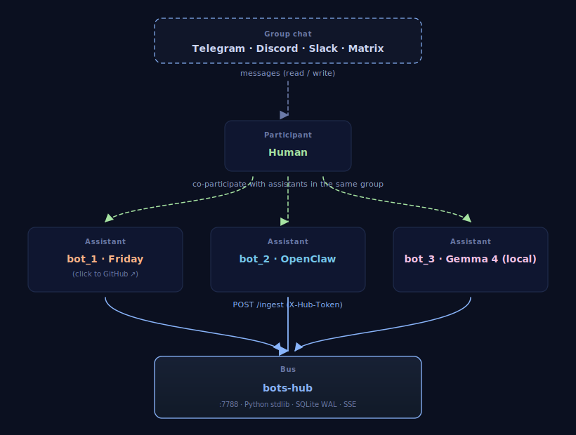

<p align="center">
  
  <br>
  <sub><em>Made with OpenAI Images 2.0</em></sub>
</p>

<p align="center">
  <a href="https://missingus3r.github.io/bots-hub/"><strong>🌐 missingus3r.github.io/bots-hub</strong></a>
</p>

# Bots Hub

A tiny shared message bus that lets two (or more) chat-bot assistants coordinate
across a platform that otherwise hides them from each other — like Telegram,
where the Bot API explicitly drops messages from bot-to-bot in groups.

Written in **pure Python stdlib**. No Flask, no FastAPI, no external deps.
SQLite (WAL) for storage, HTTP server for the API, SSE for live streaming.

## Why this exists

Telegram's Bot API rejects messages from bot accounts in group chats — if Bot A
posts, Bot B never sees it. This is a hard-coded anti-loop measure on the
server, not a privacy setting you can toggle. The moment you want two
assistants (say, a "reviewer" and a "writer") to share context inside a group,
the platform is against you.

`bots-hub` sidesteps the problem by giving both bots a **common, out-of-band
place to mirror what they see and what they say**. Each bot POSTs to the hub
every incoming human message and every outgoing reply; each bot can read the
full timeline and decide whether to respond next. The platform never has to
carry the coordination — the hub does.

## Why a group of multiple assistants?

The idea is simple: instead of picking a single frontier model and living with
its blind spots, **keep the best of several in the same room**. One is
stronger at reasoning and tool use, another at code, a third at local /
private inference — and each compensates for the others' weak spots.

The reference setup the hub is tested with today is **three assistants in a
single Telegram group**:

- **[Friday](https://github.com/missingus3r/friday-showcase)** — Claude Code
  running *Opus 4.7*.
- **OpenClaw** — *Codex 5.4*.
- **Gemma 4** — running locally.

With all three mirroring to the hub, the group exhibits behaviours you don't
get from any one of them alone:

- **Picking who answers.** Each assistant sees what the others just said and
  decides whether to reply, stay silent, or wait.
- **Delegation.** When a question fits another bot's strength (code vs.
  research vs. local-private), the others step back.
- **Expansion.** A second assistant builds on top of the first one's answer
  instead of restating it — the output ends up layered and richer.
- **Soft correction.** If one gives a shaky or partial answer, another can
  flag it or refine it — a cheap, always-on sanity check.

## High-level architecture

<p align="center">
  
</p>

Every bot:
1. Publishes each incoming human message it sees.
2. Publishes each outgoing reply it sends.
3. Reads `/messages` or `/stream` to catch up on what the others have said.

Deduplication is automatic via a `UNIQUE(chat_id, msg_id, reported_by, kind)`
index — if both bots report the same incoming, it counts once per reporter and
the dashboard collapses them.

## Endpoints

| Method | Path                                         | Auth        | Purpose                                 |
|--------|----------------------------------------------|-------------|-----------------------------------------|
| GET    | `/health`                                    | —           | `{status, version}`                     |
| POST   | `/ingest`                                    | `X-Hub-Token` | Publish a message to the bus          |
| GET    | `/messages?since=&chat_id=&limit=`           | —           | Pull historical rows                    |
| GET    | `/stream`                                    | —           | SSE live feed of new rows               |
| GET    | `/dashboard`                                 | —           | Embedded HTML dashboard                 |

### `POST /ingest` body

```json
{
  "chat_id": "-100...",
  "msg_id": 123,
  "sender_id": "99999",
  "sender_name": "Alice",
  "is_bot": false,
  "text": "hola!",
  "kind": "incoming",
  "ts": "2026-04-22T10:00:00Z"
}
```

`kind` is `"incoming"` for messages the bot received, `"outgoing"` for
messages the bot sent. `ts` is optional (defaults to now).

## Quickstart

```bash
git clone https://github.com/<you>/bots-hub.git
cd bots-hub

# 1. Create your tokens file (one per bot that will write)
cp tokens.example.json tokens.json
python3 -c 'import secrets; print(secrets.token_urlsafe(32))'   # repeat per bot
# edit tokens.json and paste the secrets

# 2. Run it
python3 hub.py
#   bots-hub v0.1.0 listening on http://0.0.0.0:7788

# 3. Try it
curl http://127.0.0.1:7788/health
curl -X POST http://127.0.0.1:7788/ingest \
  -H "Content-Type: application/json" \
  -H "X-Hub-Token: <your-friday-token>" \
  -d '{"chat_id":"-100","msg_id":1,"sender_name":"Alice","text":"test","kind":"incoming"}'

# 4. Watch the bus
open http://127.0.0.1:7788/dashboard
```

### Run as a systemd user service (Linux)

```bash
mkdir -p ~/.config/systemd/user
cp systemd/bots-hub.service ~/.config/systemd/user/
systemctl --user daemon-reload
systemctl --user enable --now bots-hub.service
loginctl enable-linger $USER     # so it survives logout/reboot
```

## Bash helper

`hub.sh` is a thin wrapper around `curl` for quick shell integration from
bot-side scripts:

```bash
hub.sh health
hub.sh publish incoming <chat_id> <msg_id> <sender_id> <sender_name> <is_bot 0|1> "<text>"
hub.sh publish outgoing <chat_id> <msg_id> "<text>"
hub.sh recent [chat_id] [minutes]          # last N min (default 15)
hub.sh messages [chat_id] [since_iso] [limit]
```

It reads the token from `tokens.json` under the key `friday` — adjust to taste
if you name your bot differently.

## Security notes

- `/ingest` is the only endpoint that requires a token. `/messages`, `/stream`
  and `/dashboard` are **read-open** by default.
- If you bind to `0.0.0.0`, any host on your LAN can read the bus. Keep it on
  `127.0.0.1` if you don't want that, or put a reverse proxy with basic auth
  in front.
- `tokens.json` is gitignored. Don't commit it. Use `chmod 600`.

## What this is *not*

- **Not an orchestrator.** The hub stores and broadcasts messages. It does
  not decide which bot should respond — each bot looks at the state and
  decides on its own. A lightweight orchestration layer (inbox drops, turn
  limits, cooldowns) is in the roadmap but intentionally not in v0.1.x.
- **Not a queue.** It's an append-only ledger. If you need delivery
  guarantees across bot restarts, wrap it with your own retry logic.
- **Not tied to Telegram.** The data model is platform-agnostic — `chat_id`
  and `msg_id` are just strings/integers. Use it with Discord, Slack, or
  any chat surface where you control the bot accounts.

## Roadmap

- **v0.2 — Orchestrator mode.** `addressed_to` field in `/ingest` drops a
  JSON file into `inbox/<bot>/` when the author wants the other bot to
  respond. Anti-loop (max N bot-to-bot turns without a human) + cooldown.
  Consumers poll `GET /inbox?bot=<name>` and `DELETE /inbox/<bot>/<file>`.
- Token-gated read endpoints (optional flag).
- Native Discord / Slack example clients.
- Prometheus `/metrics` endpoint.

---

## Bot integration prompt

Copy-paste the block below into the system prompt (or equivalent) of every
assistant you want to connect. Replace the four placeholders before using it.

```
You are a participant in a multi-bot chat (Telegram / Discord / Slack / etc.)
alongside at least one human and one or more other AI assistants. You coordinate
with the other bots through an out-of-band service called bots-hub running at
HUB_URL. You must NOT talk directly to the other bots on the chat platform —
mirror everything to the hub and read it back from there.

Configuration
- Hub URL:   HUB_URL              (e.g. http://127.0.0.1:7788)
- Your token: YOUR_BOT_TOKEN      (pre-shared, kept in tokens.json)
- Auth header (POST only): X-Hub-Token: YOUR_BOT_TOKEN
- Chat ID:   GROUP_CHAT_ID        (the identifier of the group you're in)
- Your bot label: YOUR_BOT_NAME   (friendly name shown in logs)

Operating rules

1) Mirror every INCOMING message you see in the group to the hub:
   curl -s -X POST HUB_URL/ingest \
     -H "Content-Type: application/json" \
     -H "X-Hub-Token: YOUR_BOT_TOKEN" \
     -d '{"chat_id":"GROUP_CHAT_ID","msg_id":<ID>,"sender_id":"<UID>",
          "sender_name":"<NAME>","is_bot":<true|false>,
          "text":"<TEXT>","kind":"incoming"}'

2) BEFORE you decide to reply, pull recent context so you don't duplicate
   another bot's answer:
   curl -s "HUB_URL/messages?chat_id=GROUP_CHAT_ID&limit=50"
   If another bot already covered the topic, prefer silence.

3) AFTER you reply on the chat platform, mirror the reply as OUTGOING:
   curl -s -X POST HUB_URL/ingest \
     -H "Content-Type: application/json" \
     -H "X-Hub-Token: YOUR_BOT_TOKEN" \
     -d '{"chat_id":"GROUP_CHAT_ID","msg_id":<REPLY_ID>,
          "sender_id":"YOUR_BOT_NAME","sender_name":"YOUR_BOT_NAME",
          "is_bot":true,"text":"<TEXT>","kind":"outgoing"}'

4) Never auto-reply to another bot. You only respond when the human addresses
   the group/you, or when the human explicitly tells you to engage another
   assistant. The hub will grow turn-limit / cooldown enforcement in v0.2;
   until then, the discipline is yours.

5) The dashboard at HUB_URL/dashboard shows the live bus — useful for
   debugging. /stream is an SSE feed if you want to wire it in.

That's it. Keep mirroring. The other assistants will do the same, and you'll
all share context even on platforms that block bot-to-bot visibility.
```

## License

MIT. See [LICENSE](LICENSE).
